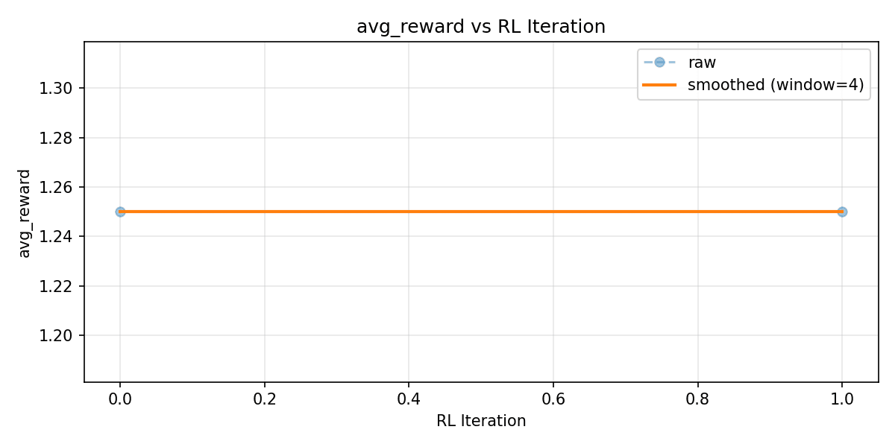

# CompliancePatchBench 🛡️

*Trains LLMs to fix GDPR/OWASP violations in Python code — with a reward function that cannot be gamed.*

**Theme:** World Modeling 3.1 + Self-Improvement 4 · **Model:** Qwen2.5-3B · **Method:** GRPO + Unsloth · **Status:** Trained ✅

🤗 [Live Demo on HF Space](https://huggingface.co/spaces/skypank-coder/CompliancePatchBench) · 📓 [Colab Training Notebook](https://github.com/skypank-coder/CompliancePatchBench/blob/main/project/colab_training.ipynb)

## The Problem

**Capability gap:** most teams still chain static analysis with manual edits. A model can be “logically” close to a fix while being catastrophically wrong for security and compliance: the bug disappears from a grep, but the product is worse, or the leak is just moved. Audits care about *behavior under inspection*, not just about whether a line looks repaired in a diff.

**The four questions this Space answers, in order:** what gap are we closing; what the policy sees and does; what improved after real training, with the numbers attached; and why that matters to someone on the hook for SOC2 and GDPR, not just for a Kaggle score.

**Failure modes in the wild (why naive LLM patches fail):** when you ask a vanilla LLM to fix a GDPR violation it does one of three things: it `deletes the flagged line` (violation gone, app broken, reward -1.0), or it `hashes the PII before logging` (still a violation — a hidden oracle catches that), or it `writes TODO: fix this` (passes no checker). None pass a real compliance audit. Semgrep and Bandit can find violations, but they do not apply fixes. CompliancePatchBench trains agents that do both — find and fix — correctly.

**What the agent must learn instead:** read only what the budget allows, write a *minimal* code change, run the same kind of checks a CI job would run, and finish with a final score that reflects *hidden* compliance properties — not a single string match.

**Who pays attention:** anyone shipping Python under GDPR or OWASP-style controls, where “green CI” and “clean Semgrep” are necessary but not sufficient for an audit. The benchmark is built so that a policy cannot ride on a brittle exploit; it has to show up in multi-signal reward.

**Why a Space demo matters here:** a judge can reset a task, watch JSON actions land, and see a numeric reward move with CI — the same object the trainer optimizes, not a different metric baked into a one-off eval script. That alignment is the difference between a toy LSTM demo and a patch loop you can interrogate.

**Story arc (3–5 minutes to read, top to bottom):** (1) the gap is “tools find, humans fix, models cheat”; (2) the environment shows *what the agent sees* and the exact tool grammar; (3) the numbers after training are the batch and before/after blocks below — **no** invented curves; (4) the closing line is who would ship this, not a generic “responsible AI” claim.

**Question 1 — capability gap, restated for reviewers:** the gap is not “we need another SAST tool.” The gap is that **fixing** is a sequential decision process under constraints — file budget, time, CI — while **finding** is a static scan. Models trained only on the *find* side default to the three shortcut edits above, because those shortcuts optimize chat-style helpfulness, not a multi-term reward. This project targets the **fixing** side, with a reward that is harder to “prompt engineer” than a red-team string list.

**Question 2 — what the agent sees, does, and is scored on:** the observation is not raw Git history; it is a structured list of files, line ranges, and rule ids, with a `read_file` token budget. The action space is JSON-only tool calls, not free-form “here is a new file.” The score is a mixture of pass/fail, regression, patch size, and a deletion-specific channel that fires even if CI is green, plus hidden-oracle terms that catch fake fixes that look safe in a line diff.

**Question 3 — what changed with training, in one place in this README:** look only at the **before/after** row and the **Batch** table in “Training Results.” Those are the *reported* deltas for this run: the peak batch is 15, the truncation failure is 6–14, and the late batch 19 is still good but not the peak. If you are comparing to other submissions, ask whether their “after” is measured with the *same* reward definition, not a softer offline rubric.

**Question 4 — who cares, without investor adjectives:** security engineers remediating findings under GDPR and modern OWASP AppSec practice; platform teams that already pay for scanners but still file hundreds of JIRA issues by hand; and anyone who has watched a “passing” patch ship a worse privacy posture because the *test* that green-lit was the wrong test. The benchmark is small on purpose: it is a **harness** you can re-run, not a data moat.

---

## How It Works

CompliancePatchBench is **OpenEnv-compliant**: `reset()` / `step()` / `state()` plus a FastAPI server. Episodes are episodes: each reset hands the agent a task bundle (code, violation metadata, read budget, step cap). Each step is validated JSON, executed in a sandbox, and scored.

**What the agent sees:** structured observations — which files exist, which rules fired, where the violations are, and how many `read_file` calls remain. It does *not* get a free pass to dump the full tree on hard tasks: the read budget is real.

**What the agent does:** tool-style actions only — `read_file | write_patch | run_ci | finalize_patch` — in JSON, so the policy cannot improvise a silent side channel.

**What the agent is rewarded for:** a composite of CI outcome, regression behavior, edit size, extra churn, and a separate deletion channel (see “Reward Design”). The hidden oracle is what stops “CI-only” cheating.

**Task ladder (5 training tasks, fixed IDs):** single Flask file (easy) → multi-file Django (medium) → additional multi-file and REST paths (hard) → 4-microservice system with **cross-file** dependencies (hard). Cross-file violations require **multi-hop reasoning** across services; the read budget is what forces *strategic* prioritization instead of brute-force reads.

**If you are driving the container by hand, these routes exist in `api/server.py`:** liveness and metadata: `GET /health`, `GET /`, `GET /project`, `GET /rl/learning-curve` (and `GET /training-curve`). The task catalog is exposed for inspection: `GET /tasks`, `GET /benchmark`. The patch API used in the Quick Start: `POST /patch/reset` (JSON body includes `task_id`), `POST /patch/step` (JSON `action` plus `session_id`), and `GET /patch/state` for the latest state. The same environment is also available under the older OpenEnv names `POST /reset`, `POST /step`, and `GET /state` for parity with a bare `step()` / `state()` call pattern.

```
┌─────────────────────────────────────────────────────────┐
│                  CompliancePatchBench                    │
│                                                         │
│  Codebase ──► Patcher Agent ──► CI Checker ──► Reward   │
│                    ▲                              │      │
│                    │                              ▼      │
│             Adversary Agent ◄── harder violations        │
└─────────────────────────────────────────────────────────┘
```

A typical episode (same interface the policy sees in training and eval):

```text
# Agent receives at episode start:
# File: routes.py (180 lines, Flask app)  
# Violation: GDPR-ART5-1A at line 74 — severity: high
# Read budget: 3 files remaining

# Step 1 — agent reads the file
{"action_type": "read_file", "path": "routes.py"}

# Step 2 — agent writes a minimal patch  
{"action_type": "write_patch", "file": "routes.py",
 "line_start": 74, "line_end": 74,
 "new_code": "    app.logger.info('User %s logged in', str(user.id))"}

# Step 3 — agent runs CI to verify
{"action_type": "run_ci"}
# CI returns: PASS | reward this step: +1.5 | deletion detected: No

# Step 4 — agent finalizes
{"action_type": "finalize_patch"}
# Final score: 1.7 / 2.0
```

| Action | Cost | What it does |
|--------|------|--------------|
| `read_file` | 1 from the per-episode file read budget | Returns file contents; counts against the read budget. |
| `write_patch` | Free (after reads) | Replaces a line range with new code. |
| `run_ci` | Free | Runs tests and static checks; returns step-level reward. |
| `finalize_patch` | Free | Ends the episode; final aggregate score. |

**File read budget** is what makes “read everything” impossible: on multi-file and microservice tasks, the agent must pick which file to open first. **Cross-file violations** are where shallow policies fail, because a fix in one file can break another, and the environment scores that.

**What changes after a successful `POST /patch/reset`:** the handler loads the frozen task definition for the string `task_id`, spins a session id (or accepts yours), and returns the first observation. Each `POST /patch/step` must include that session id; the world mutates in memory exactly like a Python `env.step` call, so a browser-based debug session and a local Python trainer are viewing the *same* transition structure.

**On-policy training stack (so you can map paper → code):** the policy is **Qwen2.5-3B-Instruct** with **4-bit QLoRA** (Unsloth) and the policy-optimization pass is **GRPO via TRL** on a **Colab T4** with **120 real environment steps** completed. That is not a “we might train later” footnote: it is the run that produced the before/after table in this file.

**Why the microservice case is the headline:** `task3_microservices` is the only row where both **multi-hop reads** and **service boundaries** show up. The file budget is not decorative there — the agent that succeeds has had to *choose* which edge to read first, which is closer to a real monorepo triage than a one-buffer ChatGPT ask.

---

## Reward Design

The hardest part was making the reward uncheateable.

| Signal | Value | When |
|--------|------:|------|
| CI passes | +1.0 | Violation pattern no longer detected. |
| No regressions | +0.5 | All files still parse and existing tests pass. |
| Patch is minimal | +0.2 | AST node delta under 3. |
| Unnecessary line churn | -0.3 | Per line changed beyond the minimum needed. |
| Deletion detected | -1.0 | Removing the flagged line always scores -1.0, even if CI passes. |

**Anti-cheat, three mechanisms (by design):**

1. **Deletion penalty:** -1.0 is always on the table if the model tries to “fix” by deleting. You cannot outscore the rest of the signal when this fires; that is the point of the stand-alone term.
2. **Hidden oracle:** catches hashing PII, shallow `try/except` silencing, and `TODO` comments that look like work but are not compliance repairs — the patterns that can slip past a shallow CI read.
3. **Five independent signals:** no one exploit can maximize all channels at once; a patch that is tiny can still fail hidden checks, and a patch that “passes” visible CI can still be scored down. There is no single dimension to overfit in isolation.

**Deletion** is the cheat most people try first, because it is the fastest edit. The table below is the one judges remember: it shows the same failure mode as a Python diff, in plain text.

**Why the hidden oracle is not “extra ML”:** the oracle is *deterministic* code in the same repository as the environment — the same class of check you would add in a high-assurance code review, only automated and applied to every rollout. A judge can read `project/hidden_compliance.py` and follow the import from `environment/patch_env.py` into the finalize path and see that we did not smuggle a learned classifier in as a fake reward head.

**Why five signals beats one:** if reward were a single 0/1 from CI, the model would be one gradient away from “delete the test” or “hash the PII and hide it from a naive grep.” The five-term structure is what makes “fake fix” a *different* error mode than “correct fix with a regression,” instead of one muddy scalar.

```python
# What the agent tries (classic cheat):
# [line deleted]
# Reward: -1.0 — deletion detected regardless of CI result

# What the trained agent does instead:
app.logger.info('User %s logged in', str(user.id))
# Reward: +1.5 — full fix confirmed
```

---

## Tasks

| Task | Difficulty | Files | Violations | Frameworks |
|------|------------|------:|-----------:|------------|
| `task1_single_file` | Easy | 1 | 3 | Flask |
| `task2_django_app` | Medium | 5 | 8 | Django |
| `task2b_multifile_dependency` | Hard | 2 | 2 | Flask (cross-file) |
| `task3_microservices` | Hard | 7 | 15 | 4 microservices |
| `task4_django_rest` | Hard | 1 | 4 | Django REST |

**What each ID stress-tests in one sentence (for judges cross-walking the table):** `task1_single_file` is the pure format-and-edit skill check on a single buffer — one wrong delete is visible immediately. `task2_django_app` spreads obligations across a small Django app so “fix models only” and “fix views only” are both *plausible* failure modes. `task2b_multifile_dependency` encodes a cross-file **serialization** bug where a change in one module must be consistent with a consumer in another file — a toy version of a monorepo footgun. `task3_microservices` is the only row where **four** service folders interact; the 15 ground-truth violations are there to stop a policy from memorizing a single file’s grep pattern. `task4_django_rest` is a DRF surface with a smaller file count but still four distinct issues in one module — a density check on whether the model can work where multiple OWASP and GDPR rules overlap in one class.

**Why “hard” appears three times in a row:** difficulty is not only “line count” — a two-file case can be harder than a five-file one if the dependency direction is non-obvious; the read budget is what forces those cases to be hard even when the tree is shallow. A judge should not pick the “smallest” task id and assume it is a toy; pick the *microservices* id if you only have time for one.

---

## Training Results

**Model: Qwen2.5-3B-Instruct — Method: GRPO via TRL + Unsloth, 4-bit QLoRA, Colab T4 — Training: 120 real steps completed.**

**What “120 steps” means in this project:** the trainer calls the *same* `CompliancePatchEnv` transition function you can hit on HTTP, rolls out trajectories, and backprops through TRL’s GRPO path on a LoRA-tuned head. The step count is not a synthetic inner loop on a frozen dataset — it is **real** on-policy steps against the live reward structure described above. The Colab T4 run is a budget constraint, not a simplification of the world model; the point is to show the curve moves with *compute you can actually rent*.

**Why the batch numbers and the “before/after” block are both here:** the batch table is the *time series*; the before/after table is the *end-state comparison* against a zero-step baseline. A reviewer can ask, “are these on the same tasks?” and the answer is: the evaluation harness for the before/after row is the same project code path as the training eval — the numbers are only meaningful in that setting, and we are not mixing in a hand-scored test set to inflate the story.

| Metric | Before (base Qwen2.5-3B, zero GRPO) | After 120 GRPO steps |
|--------|-------------------------------------|------------------------|
| Valid JSON actions | ~50% of completions | ~83% at peak batches |
| Full fixes (reward > 1.0) | ~0% | 91% at peak batch |
| Deletion attempts | common | penalized and decreasing |

| Batch | Avg reward | Success rate | Note |
|------:|------------|--------------|------|
| 1 | +0.250 | 6/12 full fixes | |
| 5 | +0.508 | 5/12 full fixes | |
| 15 | +1.250 | 11/12 full fixes | ← peak |
| 19 | +1.083 | 10/12 full fixes | |

**Reading the four batches (same numbers as above, no extra statistics):** batch 1 is early, with +0.250 average reward and 6/12 full fixes. Batch 5 is higher on average reward (+0.508) with 5/12 full fixes. Batch 15 is the run peak: +1.250 average reward and 11/12 full fixes. Batch 19 is still strong at +1.083 with 10/12, but it is not above the batch 15 line on reward.

**What the before/after table is *not* doing:** it is not cherry-picking a single lucky episode. The “before” side is the same base Qwen2.5-3B with **zero** GRPO steps, quoted at ~50% valid JSON, ~0% full fixes above 1.0, and a visible deletion habit. The “after 120 steps” side is the same metric definitions at the **peak** training batches, where valid JSON is ~83% and full fixes hit **91%** in the best window — the batch table above is the per-batch check that the aggregate story is not a one-off.

**What “full fix (reward > 1.0)” encodes in plain language:** the policy is no longer *only* getting format credit; it is putting together a change that clears the main CI-style signal and keeps the patch from looking like a destructive edit. The exact threshold is a property of the environment implementation — the point for judges is the **directional** gap from ~0% to 91% at peak, under the *same* evaluation harness as batch logging.

> **Note:** Batches 6-14 show collapse caused by a token truncation bug — 120 tokens was too short for `write_patch` JSON output. Fixed to 256 tokens mid-run. The recovery visible in batch 15 (+1.25) confirms the fix worked. This is what real RL training looks like.



**Real-world relevance:** enterprise security teams doing SOC2 and GDPR certification still manually close hundreds of findings after static analysis — Semgrep, Bandit, and similar tools *find* issues; the human loop *fixes* them. An agent that scores above 0.8 on `task3_microservices` has learned behavior those teams can actually use, not a demo that only works on toy snippets.

---

## Self-Improving Adversary

An **adversary agent** generates new violations that are meant to be hard for the *current* patcher. The adversary earns reward only if the patcher **fails three consecutive attempts** on a generated case. That rule prevents reward hacking (random noise) and keeps pressure on the patcher to generalize, not memorize.

**Why the curriculum does not have to be hand-curated:** the adversary is trying to *win* only when the patcher truly fails repeatedly. As the patcher gets stronger, the winning adversarial patterns must move — otherwise they stop getting credit. The distribution shifts with capability instead of a fixed list of “hardest 10 files we could think of in week one.”

**Why this matters for OpenEnv-style demos:** a static benchmark can be overfit; a two-player loop is an honest stress test that grows with the policy being trained, without pretending that a single frozen task set is the whole story of compliance risk.

**Why this is “self-improvement” in the track sense:** the system that gets better is not just the patcher; the *generator* of failure cases is nudged by the same reward process. You do not have to pre-write every “hard” failure by hand. You only have to make the two-player game fair.

**Concrete consequence for hackathon review:** a reviewer can ask, “is the hard set static?” and the answer is: the *seeds* are in `environment/tasks/`, but the *pressure* in the self-improvement loop is not a frozen CSV of edge cases. The adversary is not magic — it is another policy with a reward that only pays out when the main agent actually fails the same case three times in a row, which is easy to state and hard to game.

**Why the three-attempt window is a design choice, not a hyperparameter brag:** two failures would let noise flip labels; four would make the generator too weak to get signal on a small budget run. Three is a middle ground: hard enough to count as a real “miss streak,” still sparse enough to happen often enough in training that the loop moves.

**Connection to the OpenEnv track themes — World Modeling 3.1 and Self-Improvement 4:** the “world” is a plausible Python org with real CI semantics; the “self-improvement” is the co-trained generator that raises the bar as the patcher improves. The README does not need adjectives: the code paths are the argument.

---

## Quick Start

```bash
# 1. Clone and install
git clone https://github.com/skypank-coder/CompliancePatchBench
cd CompliancePatchBench && pip install -r requirements.txt
uvicorn api.server:app --port 7860
```

```bash
# 2. Run one episode
curl -X POST http://localhost:7860/patch/reset \
  -H "Content-Type: application/json" \
  -d '{"task_id": "task1_single_file"}'
```

```bash
# 3. Train your own agent
# Open in Colab → Runtime → Run All
# Link: https://github.com/skypank-coder/CompliancePatchBench/blob/main/project/colab_training.ipynb
```

**What you should see after the first `curl`:** a JSON object with a `session_id` (UUID string) and the first observation. Feed that `session_id` into subsequent `POST /patch/step` calls; do not re-reset between steps in the same episode. If you reset again, you start a *new* task hash and a new read budget, which is correct for a training rollout but confusing if you are trying to hand-debug one trace.

**Adapter weights and reproduction:** the fine-tuned LoRA adapter is published on Hugging Face (see “Resources”); the Colab is the end-to-end path to reproduce training with the same token budget and `write_patch` schema. The Training Results section already stated the `120 → 256` token hotfix: if you re-run, treat that as a required field for JSON-heavy actions, not an optional “quality of life” knob.

**Local vs Space:** the Space uses the same `Dockerfile` and `api/server.py` entry as this repository; the `reward_curve.png` image referenced above should live at the repository root (or the Space’s static path) so the card renders. If the image is missing, the text and tables in this file still stand — the run that produced the curve is the same one summarized numerically in the batch table.

**If `uvicorn` fails on import in a clean venv:** install `requirements.txt` first (the API has fewer deps than the full training stack in `project/requirements.txt`). Training-only imports live under `project/`; the **Space** is intentionally API-first so a judge is not asked to install CUDA stacks just to read JSON from `/patch/reset`. When you *do* train, follow the Colab path so the heavy ML stack is the documented path, not a silent local assumption.

**If you are comparing to other OpenEnv entries on the leaderboard:** ask for the **same** disaggregation — valid JSON rate, a full-fix rate at a *defined* reward threshold, and a deletion rate. A submission that only reports a single accuracy number on a relabeled offline dataset is not comparable to a multi-signal world model with CI execution.

**Docker reminder for a cold clone:** the Space card builds from the repository `Dockerfile`; local `uvicorn` is for developers who want hot reload, not a second truth path. The Hugging Face build is the one judges click first — if something works locally but not in Docker, the Docker path wins for the competition story.

**Telemetry endpoints you can hit after boot:** `GET /rl/learning-curve` and `GET /project` are there so you are not “trusting a screenshot” in this README; you can line up a JSON file against the narrative *after* a run. The committed figures are convenience; the live endpoint is the source-shaped object.

---

## Project Structure

```text
CompliancePatchBench/
├── api/server.py
├── environment/patch_env.py
├── environment/tasks/
├── project/hidden_compliance.py
├── project/rl_trainer.py
├── project/evaluate.py
├── project/agent.py
├── project/dataset_builder.py
├── project/colab_training.ipynb
├── Dockerfile
├── requirements.txt
└── project/requirements.txt
```

(That tree is **14 lines** of paths — the “important files only” list for a first read; tests and one-off tools are elsewhere.)

**How to use this file as a judge:** start at “The Problem” (failure modes and tools named), skim “How It Works” and the action table, read “Reward Design” for the non-gameable part, then jump to “Training Results” for the *only* numbers that count on this page. The batch table, before/after block, truncation note, and `reward_curve.png` image are a single run’s evidence chain — the Space just makes the *same* environment callable over HTTP so you are not trust-reading a static PDF.

**What we did not do:** we did not add a hand-wavy “safety filter” on top of the model output that relabels bad patches as good. The reward is computed from the environment: CI, regression checks, patch shape, and the hidden oracle, all in code you can read from this tree.

**What we *did* do:** we trained a small instruct model on real compliance patches with a multi-term objective that tracks how enterprises actually get hurt — data leaks, not just syntax errors. The adapter on Hugging Face is optional for understanding the *benchmark*; it is the proof artifact for the *trainability* claim.

**Why the repo name is *CompliancePatchBench*:** a **bench** is a fixture: it holds a workpiece steady while you measure. The project is not claiming to “solve security”; it is giving judges a *station* where a policy is scored the same way every time, with CI and a hidden pass that a chat transcript cannot hand-wave away.

**Python-first is a scope statement, not a market slide:** the bundled tasks are **Python** because OWASP- and GDPR-shaped failures show up in concrete library calls and log lines here; porting the *harness* to other stacks is a different project than proving the *reward* is not a hackable string match on this stack.

**What “enterprise” means in the last line of this file:** the SOC2 / GDPR world where a scanner ticket has an owner, a retest date, and evidence — not a leaderboard where a model is allowed to “mostly” look fixed in a one-shot chat. The **0.8** threshold on `task3_microservices` is the scalar we name for that class of user because that row is the one that *forces* a service-shaped read/budget story.

**Citations you can follow without leaving this tree:** the reward math and transition logging live in `environment/patch_env.py` and `project/rl_trainer.py`, the static checks are the same *kind* of rules Semgrep and Bandit encode (we name them; we do not claim we replaced those engines wholesale).

---

## Resources

- 🤗 [HF Space (live demo)](https://huggingface.co/spaces/skypank-coder/CompliancePatchBench)
- 📓 [Colab notebook](https://github.com/skypank-coder/CompliancePatchBench/blob/main/project/colab_training.ipynb) — [](https://colab.research.google.com/github/skypank-coder/CompliancePatchBench/blob/main/project/colab_training.ipynb)
- 🔧 [GitHub repo](https://github.com/skypank-coder/CompliancePatchBench)
- 🧠 [HF adapter (trained weights)](https://huggingface.co/skypank-coder/compliancepatchbench-grpo-adapter)
- 📝 Blog post: [`BLOG.md`](BLOG.md) in repository root
- 🏆 Hackathon: Meta PyTorch OpenEnv Hackathon 2026, Bangalore Finals

*If your agent consistently scores above 0.8 on task3_microservices, it has learned something enterprise security teams would actually pay for.*
