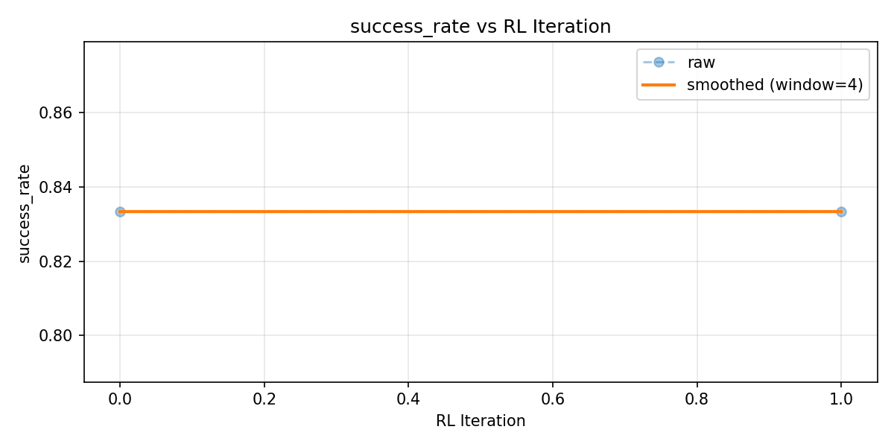
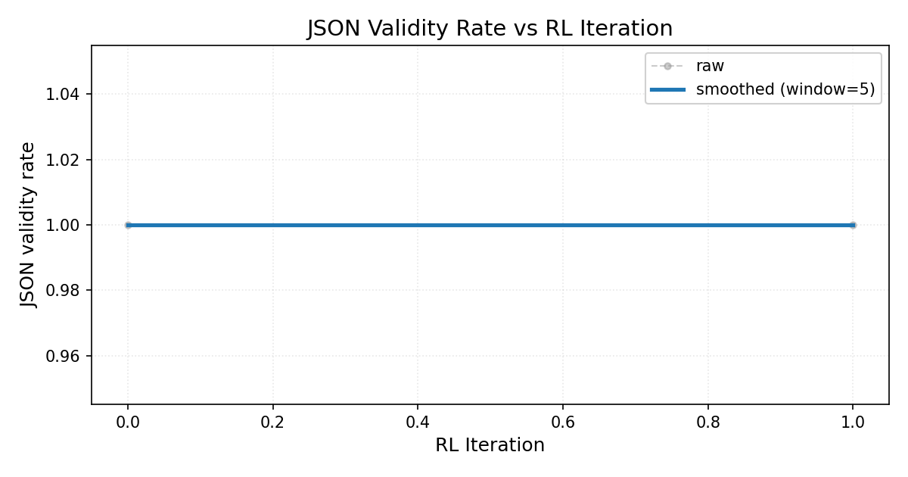

# CompliancePatchBench

AI systems can pass tests and still be wrong. CompliancePatchBench trains agents
that must fix code correctly, even when tests are misleading.

Real-world impact: a "passing" fix can still leak user data or weaken security.
This system is designed to prevent that.

Key idea: we train agents in an environment where shortcut fixes are penalized
by hidden constraints.

## What This Project Demonstrates

- A compliance/security patching environment with structured JSON actions.
- An OpenEnv-style interface with `reset`, `step`, `state`, FastAPI endpoints,
  fixed step limits, and file-read budgets.
- Diverse generated tasks across GDPR, OWASP, code quality, multi-file bugs,
  and adversarial fake-safe fixes.
- Hidden compliance checks that catch shortcut fixes which pass visible tests.
- RL-based policy optimization using GRPO via TRL.
- RL trajectories with `(state, action, reward, next_state, logprob, done)`.
- Learning curves tracking reward, success rate, and hidden-violation rate.

## Reward design (structured, not binary)

The training signal is **not** a single pass/fail bit. The environment returns a
**structured score**: CI and semantic checks, minimal-patch incentives,
regression penalties, and **hidden-oracle** penalties for “fake-safe” fixes. Invalid
or empty JSON actions are penalized so the model cannot ride on format luck alone;
correct, safe repairs are rewarded, while silent compliance violations and
adversarial shortcuts are pushed down. The training notebook reports **the same
headline metrics** (success rate, average reward, share of violations fixed,
hidden-violation rate) for the heuristic baseline and the trained policy on an
identical task set, plus a small **held-out** task batch from a different
`task_generator` seed to show generalization rather than memorization. After
evaluating baseline and trained agents on the same tasks, the training run prints
an **IMPROVEMENT** block: relative **success rate** (%) and absolute **avg_reward** delta.

## Learning and evaluation figures

These plots are generated from the committed `project/data/learning_curve.json`
(iterative offline RL / evaluation log). Regenerate with:
`python -m project.plot_submission_figures` (no retraining; reads JSON only). The
Colab run also saves an on-policy **GRPO** reward figure (often noisy) under
`project/data/figures/grpo_train_reward.png` when training completes (if generated by your run).

| Figure | What it shows |
|--------|----------------|
|  | Y-axis: **avg_reward**; X-axis: **RL Iteration**; raw + window-smoothed (offline policy-iteration log). |
|  | Y-axis: **success_rate**; X-axis: **RL Iteration**; task success = all fixable violations resolved with no hidden cheat. |
|  | Y-axis: **valid_json_rate**; X-axis: **RL Iteration**; higher means more structured, parseable actions (raw + smoothed). |

## Why This RL Cannot Be Cheated

The reward is not just "did the regex pass?" It is grounded in three checks:

1. **CI + tests** catch visible correctness failures.
2. **Hidden oracle** penalizes shortcut fixes like hashed PII, masked PII,
   weak crypto, hardcoded env defaults, and partial multi-file fixes.
3. **Adversarial tasks** include fake-safe fixes, misleading comments, and
   cross-file dependencies.

These are exactly the kinds of bugs that slip past production systems today.

In short: the agent learns from mistakes and gradually avoids bad fixes. The
agent does not just learn to fix code; it learns to avoid cheating because the
environment penalizes hidden violations.

## RL + Policy Optimization

We use heuristic/tabular rollouts for initial data collection and baseline
comparison. Final policy optimization is performed using GRPO via TRL.

This is an online reinforcement learning loop with environment feedback:
the current policy generates JSON patch actions, `CompliancePatchEnv` executes
them and returns reward, and `GRPOTrainer` updates that same policy for the next
iteration. Evaluation remains deterministic.

The RL loop is designed to scale to larger task distributions; this demo uses a
small subset for runtime constraints.

The loop is failure-aware and adaptive: each iteration tracks
`hidden_violation`, `partial_fix`, and `no_fix`, increases sampling weight on
failed/adversarial tasks, evaluates an unseen test split, and reports recovered
tasks that failed in one iteration but succeeded later. It also logs confidence
so "high confidence but wrong" patches are visible instead of hidden.

Pipeline:

```text
heuristic rollouts -> SFT initialization -> online GRPO rollouts -> GRPO-refined policy
```

**Submission graphics:** `project/data/figures/reward_curve.png`, `success_curve.png`, `json_validity_curve.png` (and optional `grpo_train_reward.png` from the notebook).

## OpenEnv Hackathon Checklist

- Environment first: `CompliancePatchEnv` exposes reset/step/state behavior and
  is wrapped by FastAPI routes for local or Hugging Face Space deployment.
- Verifiable rewards: CI checks, semantic validation, minimal patch scoring,
  deletion detection, hidden compliance checks, partial-fix penalties, timeout
  penalties, and file-budget limits are independent reward/process signals.
- Curriculum: generated tasks include easy, medium, and hard distributions so
  the agent gets non-zero reward before harder adversarial cases.
- Adaptive training: failed and adversarial tasks are sampled more often, while
  consistently solved tasks are sampled less.
- Generalization: the RL loop trains on a train split and reports
  `test_success_rate` on unseen tasks.
- Training stack: SFT uses Unsloth/LoRA where available, and final policy
  optimization uses TRL `GRPOTrainer` with environment reward feedback.
- Demo evidence: `project.smoke_test`, difficulty-aware evaluation, failure-case
  logging, and `/training-curve` (or `/rl/learning-curve`) show the baseline, rewards, safeguards, and
  improvement path.

## Important Files

```text
project/
├── task_generator.py       # Generates easy/medium/hard compliance patch tasks
├── agent.py                # Strict-JSON agent loop + RL transition capture
├── hidden_compliance.py    # Hidden anti-cheat oracle
├── dataset_builder.py      # Rollouts -> filtered SFT dataset
├── train_model.py          # LoRA SFT pipeline
├── rl_trainer.py           # RL loop: rollout -> reward-to-go -> policy update
├── evaluate.py             # Difficulty-aware metrics + iteration comparison
├── model_training_.ipynb  # Main GRPO / training notebook
└── README.md               # Detailed technical documentation

api/server.py               # FastAPI service for Docker/Hugging Face Spaces
Dockerfile                  # Hugging Face Docker runtime
HF_SPACE_DEPLOYMENT.md      # Deployment guide
```

## Quick Start

Install the lightweight API/test dependencies:

```bash
pip install -r requirements.txt
```

For the full SFT/RL training stack, also install the ML dependencies:

```bash
pip install -r project/requirements.txt
```

```bash
python -m project.task_generator --num 40 --seed 42
python -m project.dataset_builder --rollouts 1 --min-success 0.5
python -m project.evaluate run --tag baseline
python -m project.rl_trainer --iterations 3 --dry-run
python -m project.evaluate iterations
```

One-command proof for judges:

```bash
PYTHONDONTWRITEBYTECODE=1 python -m project.smoke_test
```

Expected signal:

```text
competition smoke test passed
Iter 0 -> reward ...
Iter 1 -> reward ...
```

## Training notebook

Primary training notebook:

[`project/model_training_.ipynb`](project/model_training_.ipynb)

## Docker / Hugging Face Spaces (API)

- **API (FastAPI, backend):** [huggingface.co/spaces/rachana05/Compliance-patch-bench](https://huggingface.co/spaces/rachana05/Compliance-patch-bench)

This repository ships **only the backend** Space (root `Dockerfile` + `app.py` + `api/`). See `HF_SPACE_DEPLOYMENT.md` for push steps and how `project/data/learning_curve.json` is served.

```bash
docker build -t compliancepatchbench .
docker run --rm -p 7860:7860 compliancepatchbench
curl http://localhost:7860/health
curl http://localhost:7860/project
curl http://localhost:7860/rl/learning-curve
```

See `HF_SPACE_DEPLOYMENT.md` for the deployment checklist.
Space metadata reference: [Spaces config](https://huggingface.co/docs/hub/spaces-config-reference).
