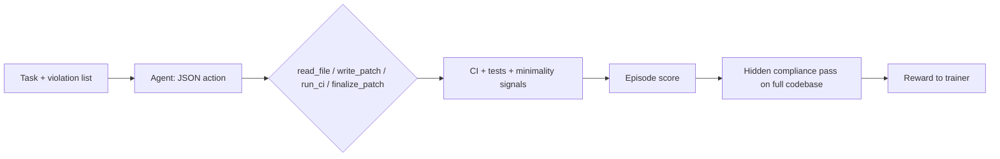

# Teaching a Model to Patch Real Code for Compliance (Not Just to Look Compliant)

## 1. Hook — the real-world problem

Regulated teams ship code under GDPR, OWASP, and SOC2-style expectations. A single pull request can look “fixed” because a linter or unit test went green, while the real obligation is still broken across files or hidden behind a shortcut. **The hard part is not typing a patch; it is proving the harm is actually gone when a motivated reviewer gets a second pass at the same tree.** CompliancePatchBench exists to train and measure patch agents under that stricter story: visible checks, plus a narrow hidden pass that catches cosplay fixes (for example hashed email still treated as personal data, or secrets smuggled through default environment reads).

## 2. Why existing tools fail

Traditional static tools and one-shot LLM prompts share a failure mode: they optimize for the signal in front of them. If CI only encodes part of the obligation, the model learns to satisfy CI, not the obligation. **Shortcut fixes that please the first screen are the quiet killer of every compliance program.** Our environment therefore never treats one green bar as dispositive: the same rollout can pass a pattern check and still fail a pessimistic follow-up that only fires when a cheat is unmistakable.

## 3. Why reinforcement learning helps

Supervised demos can teach format, but they rarely teach *when to stop* or *how to recover* from a bad edit under a budget. Online RL with a real environment lets the policy see counterfactuals: the same JSON action shape, but different next states and rewards. **The trainer only sees what the environment returns; there is no separate answer key file that short-circuits credit assignment.** That is the right match for compliance patches, where the “right” move depends on what is still broken in the repo after the last `write_patch`.

## 4. How the system works (simple picture)

The patch loop is intentionally small: read files within a budget, edit line ranges, run CI, finalize, then let a hidden scan see the whole tree. You can read this as “act like an engineer with a ticket,” not like a detector that only labels problems.

Training in our Colab runbook (`project/colab_training (3).ipynb`, default `GRPO_MAX_STEPS=120`) builds a dataset from several task modules (including multi-file Django and microservices tasks) and feeds environment reward back into TRL GRPO. **You are not watching a slideshow of correct answers; you are watching a policy get graded on actions that either help or hurt the real tree.**

## 5. Reward design (short and clear)

Per step, the patch environment combines a few interpretable pieces: CI pass on a targeted violation, regression and test signals, a minimality-style signal, and heavy penalties for deletion cheats. At the end, hidden checks can still push the score down if the code *looks* fixed but violates a rule that only the second pass sees. **The point is not a single magic number; it is that no one component is allowed to stand in for the whole obligation.** (Open `openenv.yaml` and `compute_patch_reward` in `environment/patch_env.py` if you want the exact weights; the blog stays at the idea level on purpose.)

## 6. Learning proof — what judges should look at

Raw RL lines wiggle. **We surface a moving average (default window ~6) on `avg_reward`, and we print “last 10” averages so a single bad tail does not define the run.** After training, `project/data/learning_curve.json` holds one row per RL iteration; `python -m project.evaluate iterations` prints a table with raw reward, smoothed reward, and valid-JSON rate when logged, then a “learning proof” footer. Figures land in `project/data/figures/` via `python -m project.evaluate curves --window 6`. The API also exposes `GET /rl/learning-curve` with a `derived` block (smoothed series, last-10 headline metrics) so a Space or deck can chart the same story without re-deriving math.

**Model improves over time when the smoothed reward and last-10 averages trend up; agent learns structured actions when the valid-JSON column trends up.**

## 7. Demo — step-by-step on a multi-file task

For a judge-facing trace, run evaluation on a multi-file task (for example `task2_django_app` or `task3_microservices` in your task list) with demo logging:

`python -m project.evaluate run --tasks <your tasks.json> --llm heuristic --demo-trace`

**You will see lines like** `Step   3 | write_patch    | r=+0.800 | Fixed 2/8 violations (in progress)` **and a closing block with final score and per-rule CI pass/fail lines when available.** That format is meant to show reasoning as a sequence of structured actions with reward progression, not as a wall of prose.

## 8. Results — baseline versus trained

Use the same ordered task set for both policies, then compare reports:

`python -m project.evaluate compare --before project/data/eval_baseline.json --after project/data/eval_trained.json --format both`

The console prints **BEFORE (baseline)** and **AFTER (trained)** with success rate and average reward, then **IMPROVEMENT** with arrow formatting (for example `0.32 → 0.68`). **Performance increases vs baseline when trained success rate and average reward are both higher on that same task list.** A one-command “submission” flow that also runs a held-out split is available as `python -m project.evaluate submission --help`.

## 9. Generalization

When you evaluate on a disjoint hold-out split from the same pool, the harness prints a **GENERALIZATION TEST** block. If trained success rate stays at or above baseline on held-out task IDs, we print an explicit line that **performance remains strong on unseen tasks, indicating generalization.** If the slice is too small or the run is noisy, treat the line as a sanity check rather than a theorem.

## 10. Limitations (honest)

**First**, this is still a bounded Python benchmark: it is not a substitute for your org’s full production stack, third-party audits, or legal review. **Second**, any online RL story is variance-heavy; always read smoothed curves and last-10 averages next to point estimates, and never cherry-pick a single step or a single task ID as the whole result.

---

*CompliancePatchBench is open source. Environment, tasks, graders, and Colab runbook `project/colab_training (3).ipynb` (default `GRPO_MAX_STEPS=120`) at 
https://github.com/skypank-coder/CompliancePatchBench  
Trained adapter: https://huggingface.co/skypank-coder/compliancepatchbench-grpo-adapter*
